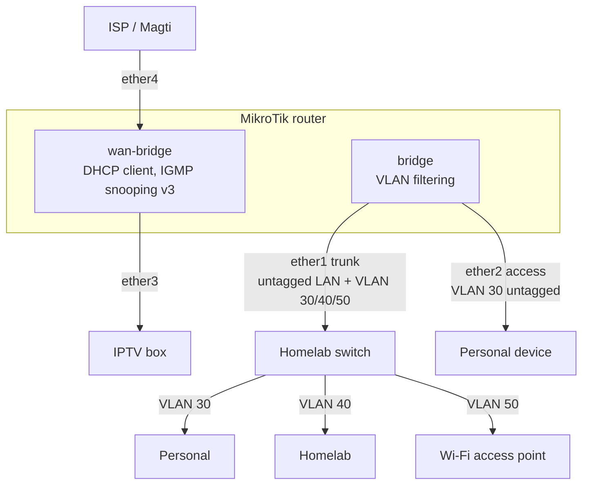

# Network

A MikroTik router running RouterOS handles routing for the home network. The full
configuration export is in [config.rsc](./config.rsc). This document
explains what that configuration does.

## Topology



## Physical ports

| Port     | Bridge       | Role           | Notes                                        |
|----------|--------------|----------------|----------------------------------------------|
| `ether1` | `bridge`     | Homelab Switch | Trunk: untagged LAN, tagged VLANs 30, 40, 50 |
| `ether2` | `bridge`     | Personal Port  | Access port, VLAN 30 untagged                |
| `ether3` | `wan-bridge` | IPTV Box       | Bridged with the ISP port                    |
| `ether4` | `wan-bridge` | ISP Port       | Uplink to the ISP                            |
| `ether5` | —            | —              | Disabled                                     |
| `sfp1`   | —            | —              | Disabled                                     |

## Bridges

- **`bridge`**: The LAN bridge, with `vlan-filtering=yes`. It carries the untagged
  management LAN and the VLAN interfaces. It belongs to the `LAN` interface list.
- **`wan-bridge`**: Bridges the ISP port (`ether4`) with the IPTV box
  (`ether3`), so the set-top box talks to the ISP directly. IGMP snooping
  (v3) is on for multicast IPTV. The router gets its public address
  from a DHCP client on this bridge (comment `Magti`). It belongs to the `WAN`
  interface list.

## Networks

| Name     | Interface  | VLAN | Subnet           | Gateway       | DHCP pool                         | DNS servers              |
|----------|------------|------|------------------|---------------|-----------------------------------|--------------------------|
| LAN      | `bridge`   | —    | `10.8.8.0/26`    | `10.8.8.1`    | `10.8.8.30` – `10.8.8.62`         | `10.8.8.1`, `8.8.8.8`    |
| Personal | `personal` | 30   | `172.24.30.0/24` | `172.24.30.1` | `172.24.30.128` – `172.24.30.254` | `172.24.40.2`, `8.8.8.8` |
| Homelab  | `homelab`  | 40   | `172.24.40.0/24` | `172.24.40.1` | `172.24.40.192` – `172.24.40.254` | `172.24.40.2`, `8.8.8.8` |
| Wi-Fi    | `wi-fi`    | 50   | `172.24.50.0/24` | `172.24.50.1` | `172.24.50.16` – `172.24.50.254`  | `172.24.40.2`, `8.8.8.8` |

Addresses outside the DHCP pools are kept for static assignments. The VLANs
use `172.24.40.2`, a host in the Homelab network, as their primary DNS server.
Google DNS is the fallback.

### Bridge VLAN table

| VLAN | Tagged           | Untagged |
|------|------------------|----------|
| 30   | `ether1`, bridge | `ether2` |
| 40   | `ether1`, bridge | —        |
| 50   | `ether1`, bridge | —        |

## Firewall

### Input chain (traffic to the router)

The router evaluates these rules in order:

1. Drop sources in the `blacklist` address list (logged as `IN-BLACKLIST`).
2. Accept `established`, `related` and `untracked` connections.
3. Drop `invalid` connections (`IN-INVALID`).
4. Detect TCP port scanners (`psd=21,3s,3,1`) and add them to `blacklist`
   for one week.
5. Accept everything from the admin laptop ("zenbook"), matched by MAC address.
6. Allow Wi-Fi clients to reach the router for DHCP (UDP 67) and DNS
   (TCP/UDP 53).
7. Drop Winbox (TCP 8291) and SSH (TCP 2202) from the Homelab network
   (`IN-BLOCK-WINBOX-LAB`, `IN-BLOCK-SSH-LAB`).
8. Drop any other traffic from Wi-Fi to the router (`IN-BLOCK-WIFI`).
9. Drop everything else that arrives from the `WAN` list (`IN-BLOCK-WAN`).

Any traffic that no rule matches, such as other traffic from LAN-side networks, is accepted.

### Forward chain (traffic through the router)

1. FastTrack `established`/`related` connections and accept them.
2. Isolate the networks from each other:

   | From \ To | LAN      | Personal | Homelab | Wi-Fi    | Internet |
   |-----------|----------|----------|---------|----------|----------|
   | LAN       | —        | allow    | allow   | allow    | allow    |
   | Personal  | allow    | —        | allow   | allow    | allow    |
   | Homelab   | **drop** | **drop** | —       | **drop** | allow    |
   | Wi-Fi     | **drop** | **drop** | allow   | —        | allow    |

   Wi-Fi → Homelab stays open so that Wi-Fi clients can use the DNS server at
   `172.24.40.2`. The `established,related` rule lets replies through for
   connections that an allowed network started.

3. Drop `invalid` connections (`FWD-INVALID`).
4. Drop new connections from `WAN` that weren't destination-NATed
   (`FWD-BLOCK-WAN`).

Every drop rule is logged with the prefix shown in that rule.

### NAT

Outbound traffic that leaves through the `WAN` list is masqueraded.

### Address lists

| List        | Entries                         | Purpose                                                   |
|-------------|---------------------------------|-----------------------------------------------------------|
| `blacklist` | Dynamic (port scanners, 1 week) | Dropped at the top of the input chain                     |
| `whitelist` | `172.24.30.0/24`, `10.8.8.0/26` | Personal and LAN networks (no rule references it yet) |

## Router services and hardening

| Service | State    | Details                                                              |
|---------|----------|----------------------------------------------------------------------|
| SSH     | Enabled  | Port `2202`, `strong-crypto=yes`, allowed from LAN, Personal, Wi-Fi  |
| Winbox  | Enabled  | Allowed from LAN, Personal, Wi-Fi                                    |
| FTP     | Disabled |                                                                      |
| Telnet  | Disabled |                                                                      |
| WWW     | Disabled |                                                                      |
| API     | Disabled |                                                                      |
| API-SSL | Disabled |                                                                      |

The service allow-lists include Wi-Fi, but the input firewall drops all
Wi-Fi traffic to the router except DHCP and DNS. In practice, you can only
manage the router from LAN, from Personal, or from the admin laptop (matched by MAC).

Other restrictions:

- Neighbor discovery runs only on the `LAN` interface list.
- MAC server and MAC Winbox are limited to the `LAN` interface list.

## System

- Time zone: `Asia/Tbilisi`.
- The NTP client is on and syncs from `time.cloudflare.com`.
- IPv6 neighbor discovery advertises DNS.

## Applying the configuration

Upload [config.rsc](./config.rsc) to the router and import it:

```routeros
/import file-name=config.rsc
```

Before you import, replace the placeholder MAC address in the
`allow zenbook` firewall rule with the real one.
